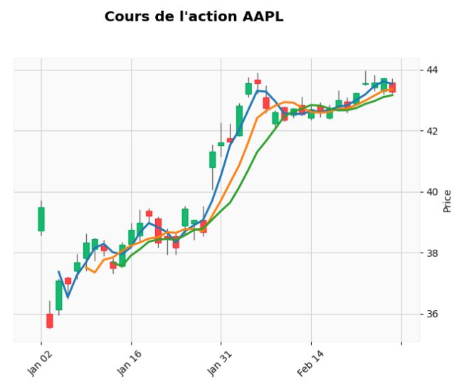
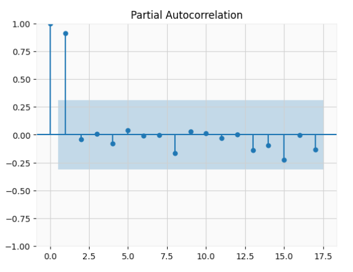

# Stock Analysis
Analyse de cours boursiers dans le cadre du cours de Séries temporelles.

|                               |                        |
|:-----------------------------:|:----------------------:|
|  |  |

Etude de plusieurs actions issues du CAC40, S&P 500, crypto-monnaies (à décider...)

**Domaine d'étude :**
- prédiction de cours boursiers (_analyse technique_ dans le jargon financier)
- étude de la volatilité
- clustering sur les différentes actions
- clustering sur les caractéristiques des actions (ratios, rendements, volatilité, etc)

Nos séries temporelles s'étalent (pour la majorité) du début des années 2000 jusqu'à aujourd'hui.

# Librairies utilisées
- librairies scientifiques (numpy, matplotlib, scipy, scikit-learn, statsmodels, pandas, keras, tensorflow)
- mplfinance => tracé de cours boursiers (Matplotlib Finance)
- yfinance => scraping de cours boursiers (API de Yahoo Finance)
- backtesting.py => évaluation de stratégies algorithmiques sur des données passées

# Jeux de données
- jeu de données potentiel : https://www.kaggle.com/datasets/paultimothymooney/stock-market-data

# Organisation des dossiers

Voici l'organisation des différents dossiers du projet :

[`📂 data`](data)
> Contient les données d'actions au format csv.

[`📂 docs`](docs)
> Contient la documentation du projet.

[`📂 img`](img)
> Contient les images utilisées dans la documentation.

[`📂 src`](src)
> Contient le code source du projet.
